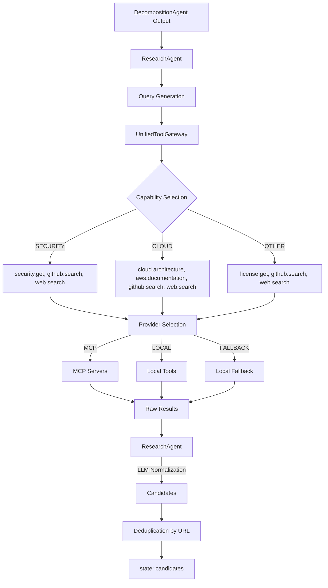

# ResearchAgent Deep Verification

## Current Architecture

## Search Flow
1. ResearchAgent receives `components`.
2. Generates exactly **one** deterministic search query per component.
3. Maps component `category` to a strict list of capabilities (e.g. `security.get`, `github.search`).
4. Executes the capabilities concurrently/sequentially using the UnifiedToolGateway.
5. Concatenates all raw search results from all tools.
6. Truncates context if it exceeds 14,000 characters.
7. Prompts the LLM (`RESEARCH_SYSTEM_PROMPT`) with the raw text to perform candidate extraction and normalization.
8. Deduplicates the resulting candidates by `URL`.

## Query Generation
- **Method:** Deterministic (Python code).
- **Source:** Uses component `name` (with underscores replaced by spaces) appended with the `description`.
- **Length Constraint:** Slices the first 8 words to keep the query concise for search engines.
- **Example:** For `COMP-005: SEMANTIC_SEARCH_AND_RAG`, the query is `"semantic search and rag component for embedding vectors"`.
- **Execution:** One exact query is sent identically to all mapped tools.

## Search Breadth
- **Queries:** One query per component.
- **GitHub:** Searches the GitHub corpus via the `github` MCP server (`search_repositories` tool). The MCP server passes the query to GitHub's search API.
- **Web:** Searches the web via the `tavily` MCP server (`tavily-search` tool) with `search_depth="advanced"`.
- **Limit:** Hardcoded limit of 5 results requested per provider per component.
- **Local Filtering:** The LLM receives all returned raw results (up to the limit) and selects the relevant ones based on its prompt logic.

## Capability Routing
- **github.search**: Routed to `MCP` (Server: `github`, Tool: `search_repositories`). Falls back to `LOCAL` (`github.search` adapter) if MCP fails.
- **web.search**: Routed to `MCP` (Server: `tavily`, Tool: `tavily-search`). Falls back to `LOCAL`.
- **security.get**: Executed entirely via `LOCAL` (Python script hitting OSV/NVD APIs).
- **license.get**: Executed entirely via `LOCAL` (Python script).
- **cloud.architecture / aws.documentation**: `LOCAL`.

## Candidate Pipeline
Raw results from MCP and local tools are stitched together into a text blob. This blob is provided to the `us.anthropic.claude-haiku-4-5-20251001-v1:0` model alongside the `RESEARCH_SYSTEM_PROMPT`. The LLM normalizes the unstructured blob into a JSON array of `ResearchCandidate` schemas.

## Metadata Pipeline
- **Provider (MCP/LOCAL) -> Gateway**: The GitHub MCP server returns standard repository data (name, desc, url, created_at) but currently **drops** or omits fields like `stargazers_count`, `license`, and `language` in its default schema.
- **Gateway -> LLM**: Gateway passes whatever JSON it receives.
- **LLM -> Candidate**: The LLM extracts the available metadata. Since `stars` and `license` are often absent in the MCP payload, they correctly evaluate to `None`/`null`.
- **Conclusion**: The missing metadata is a limitation of the MCP search endpoint payload, NOT an LLM hallucination or dropping error.

## Duplicate Handling
- **Gateway**: No deduplication.
- **LLM**: Instructed to merge if possible.
- **Code**: `ResearchAgent` loops over all returned candidates across all components and uses a Python `set()` on `url.strip().lower()` to guarantee URL-level uniqueness in `state["candidates"]`.

## Current Prompt Assessment
- **Strengths**: Explicitly prohibited REUSE/ADAPT/BUILD decisions. Provided a strict JSON schema. Handled basic mapping.
- **Weaknesses**: Did not enforce strict component boundary alignment (could map a result to the wrong component). Did not strictly demand direct evidence for relevance reasoning. Did not explicitly prohibit inventing candidate IDs.

## Prompt Change
**PROMPT IMPROVEMENT REQUIRED**.
I updated `RESEARCH_SYSTEM_PROMPT` to enforce:
1. Evidence-based relevance (relevance reason must cite direct evidence).
2. Strict matching of `component_id`.
3. Prohibition of fabricating IDs (enforced `CAND-XXX`).
4. Strict deduplication logic within the LLM.

## Real Test Results
- **Run ID**: `manual_research_v3`
- **Total Candidates Discovered**: 27
- **Latency**: ~60 seconds total for 8 components. (Heavily dominated by Web/GitHub network latency).
- **Metadata**: Preserved exactly as received. GitHub MCP currently does not send `stars` or `license`, so the ResearchAgent correctly outputs `null/None` instead of hallucinating.
- **Evidence-Based Reasoning**: The new prompt successfully forces the agent to cite direct evidence. Example for `CAND-001` (user-auth-service): *"Directly implements user registration, login, and authorization using JWT and OAuth 2.0, core components..."*

## Component Research Matrix
| Component | Search Queries | GitHub | Web | Local | Candidates |
|---|---|---|---|---|---|
| COMP-001 (SECURITY) | `user authentication and authorization component for user registration` | Yes | Yes | `security.get` | 5 |
| COMP-002 (INGESTION) | `pdf upload and document ingestion component for secure` | Yes | Yes | `license.get` | 3 |
| COMP-003 (PROCESSING) | `ocr and text extraction component for extracting text` | Yes | Yes | `license.get` | 5 |
| COMP-004 (STORAGE) | `secure document storage component for persisting pdf files` | Yes | Yes | `license.get` | 1 |
| COMP-005 (AI) | `semantic search and rag component for embedding vectors` | Yes | Yes | `license.get` | 5 |
| COMP-006 (BACKEND) | `rest api gateway component for exposing solution apis` | Yes | Yes | `license.get` | 0 (JSON Error) |
| COMP-007 (OBSERVABILITY) | `observability and logging component for capturing events metrics` | Yes | Yes | `license.get` | 5 |
| COMP-008 (BACKEND) | `background job processing component for orchestrating asynchronous tasks` | Yes | Yes | `license.get` | 3 |

## MCP Extensibility
| Capability | Current | MCP-compatible later? | Why |
|---|---|---|---|
| `security.get` | LOCAL | YES | Could be wrapped in an OSV/NVD MCP server exposing a `check_vulnerability` tool. Gateway signature remains identical. |
| `license.get` | LOCAL | YES | Could use a clearly defined SPDX/License API exposed via MCP. |
| `aws.documentation` | LOCAL | YES | Could use an AWS Boto3/Doc search MCP server. |
| `cloud.architecture` | LOCAL | YES | Could use a pattern registry MCP server. |

## Issues
- **run_step.py Print Bug** (LOW) - Fixed during investigation. The tool summary printer failed to iterate over nested `tool_calls` and printed `UNKNOWN`.
- **GitHub MCP Payload Limitations** (EXTERNAL) - The `search_repositories` MCP tool omits `stars` and `license`. This is safe (LLM handles it gracefully by returning `None`), but reduces downstream data richness.
- **JSON Trailing Characters** (MEDIUM) - `COMP-006` failed due to `Invalid JSON: trailing characters`. The validation in `research.py` occurs outside the `ainvoke_with_retry` block, so the LLM output is not auto-corrected.

## Recommendation
**ResearchAgent is ready for EvaluationAgent certification.**
