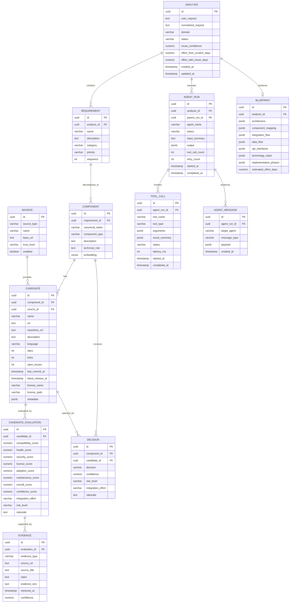

# BuildSmart — Data Model

## 1. Purpose

This document defines the logical and physical data model for the BuildSmart MVP.

BuildSmart needs to persist five categories of information:

1. The user's solution analysis.
2. The technical requirements and components discovered by agents.
3. Reusable candidates discovered from public ecosystems.
4. Evidence and evaluations used to make Build / Reuse / Adapt decisions.
5. Agent execution and tool-call traces needed for transparency and debugging.

The MVP uses PostgreSQL. `pgvector` is optional but recommended when semantic candidate/component similarity is enabled.

---

## 2. Core Entity Model



---

## 3. Entity Definitions

### 3.1 `analysis`

The root entity for a BuildSmart run.

Recommended statuses:

```text
CREATED
DECOMPOSING
SEARCHING
EVALUATING
DECIDING
BLUEPRINT_GENERATING
VALIDATING
COMPLETED
FAILED
```

Example:

```json
{
  "id": "analysis-uuid",
  "user_request": "Build an AI document intelligence platform",
  "domain": "document_intelligence",
  "status": "EVALUATING",
  "reuse_confidence": 0.87
}
```

### 3.2 `requirement`

A business or technical capability derived from the original request.

Examples:

```text
Document ingestion
PDF parsing
OCR
Embedding generation
Semantic retrieval
API
Authentication
```

### 3.3 `component`

A normalized technical capability.

Use canonical names so different user wording maps to the same concept:

```text
"PDF extraction"
"PDF parser"
"document text extraction"
        ↓
DOCUMENT_PARSING
```

Recommended canonical component types:

```text
DATA_INGESTION
DOCUMENT_PARSING
OCR
TEXT_PROCESSING
CHUNKING
EMBEDDING
VECTOR_DATABASE
RETRIEVAL
RERANKING
LLM
API
AUTHENTICATION
FRONTEND
OBJECT_STORAGE
MESSAGE_QUEUE
OBSERVABILITY
SECURITY
DOMAIN_LOGIC
```

### 3.4 `source`

Represents a public ecosystem source.

Examples:

```text
GITHUB
WEB
DOCUMENTATION
PACKAGE_REGISTRY
CLOUD_ARCHITECTURE
LICENSE
SECURITY
```

### 3.5 `candidate`

A reusable project, library, package, framework, reference implementation or architecture.

Important principle:

> A candidate is a project-level concept; GitHub, PyPI and documentation URLs can be represented as metadata/evidence for the same candidate.

### 3.6 `candidate_evaluation`

Stores the evaluation result.

Suggested weights:

```text
compatibility  = 30%
health         = 20%
security       = 15%
license        = 15%
adoption       = 10%
maintenance    = 10%
```

### 3.7 `evidence`

Every important recommendation should be traceable to evidence.

Evidence should contain:

- Source.
- URL.
- Claim.
- Supporting text/metric.
- Retrieval timestamp.
- Confidence.

### 3.8 `decision`

Allowed values:

```text
REUSE
ADAPT
BUILD
```

A `BUILD` decision may have `candidate_id = NULL`.

### 3.9 `blueprint`

Stores the final implementation plan.

Prefer JSONB for generated structures because the blueprint schema will evolve quickly during the hackathon.

### 3.10 `agent_run`

Tracks agent execution for the agentic UI and debugging.

Example:

```text
Supervisor
  └── Decomposition
  └── Research
       ├── GitHub Search
       └── Web Search
  └── Evaluation
  └── Decision
  └── Blueprint
  └── Validation
```

### 3.11 `tool_call`

Stores tool usage without exposing secrets.

Never persist:

```text
API keys
OAuth tokens
Authorization headers
raw sensitive credentials
```

---

## 4. Recommended Indexes

```sql
CREATE INDEX idx_analysis_status
ON analysis(status);

CREATE INDEX idx_requirement_analysis
ON requirement(analysis_id);

CREATE INDEX idx_component_requirement
ON component(requirement_id);

CREATE INDEX idx_candidate_component
ON candidate(component_id);

CREATE INDEX idx_candidate_source
ON candidate(source_id);

CREATE INDEX idx_candidate_license
ON candidate(license_spdx);

CREATE INDEX idx_evaluation_candidate
ON candidate_evaluation(candidate_id);

CREATE INDEX idx_decision_component
ON decision(component_id);

CREATE INDEX idx_agent_run_analysis
ON agent_run(analysis_id);

CREATE INDEX idx_tool_call_agent_run
ON tool_call(agent_run_id);
```

If using pgvector:

```sql
CREATE INDEX idx_component_embedding
ON component
USING hnsw (embedding vector_cosine_ops);
```

---

## 5. Data Ownership

| Entity | Primary Owner |
|---|---|
| Analysis | Backend / Supervisor |
| Requirement | Decomposition Agent |
| Component | Decomposition Agent |
| Candidate | Research Agent |
| Evaluation | Evaluation Agent |
| Evidence | Research / Evaluation |
| Decision | Decision Agent |
| Blueprint | Blueprint Agent |
| Agent Run | Agent Runtime |
| Tool Call | MCP / Tool Runtime |

---

## 6. MVP Principle

Do not create a complex enterprise schema during the hackathon.

The minimum persisted path is:

```text
Analysis
  → Requirements
  → Components
  → Candidates
  → Evaluations
  → Evidence
  → Decisions
  → Blueprint
```

Agent execution records are added for traceability and demo value.
