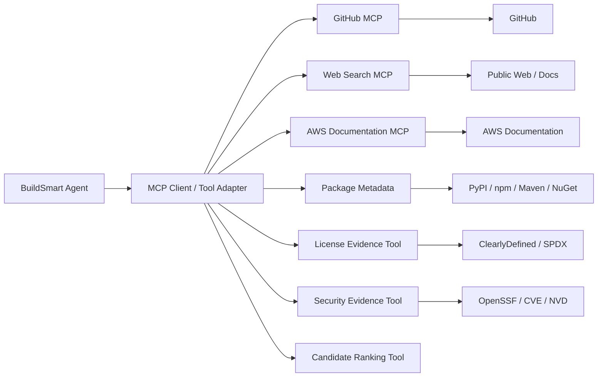

# BuildSmart — MCP & Tool Specification

## 1. Purpose

This document defines how BuildSmart agents access external ecosystems.

The core principle is:

> Reuse existing MCP servers where they are mature and suitable; build only BuildSmart-specific wrappers where necessary.

---

## 2. Tool Architecture



---

## 3. Existing MCPs / Services to Reuse

### 3.1 GitHub MCP

Purpose:

- Repository discovery.
- Repository metadata.
- Code/context search.
- Releases.
- GitHub security context where appropriate.

BuildSmart should prefer read-only operations.

Repository:

```text
https://github.com/github/github-mcp-server
```

### 3.2 AWS Documentation MCP

Purpose:

- AWS documentation search.
- AWS service guidance.
- Architecture research.

Repository:

```text
https://github.com/awslabs/mcp
```

### 3.3 MCP Registry

Purpose:

- Discover public MCP servers.
- Future dynamic capability discovery.

Registry:

```text
https://registry.modelcontextprotocol.io
```

For the hackathon, use a curated allow-list rather than allowing agents to install arbitrary servers dynamically.

---

## 4. Custom BuildSmart Tools

Build only thin wrappers for:

```text
License Evidence Tool
Security Evidence Tool
Candidate Enrichment Tool
Candidate Ranking Tool
Evidence Store Tool
```

These tools normalize provider-specific data into BuildSmart's internal format.

---

## 5. Tool Interface

Conceptual Python contract:

```python
class BuildSmartTool:
    name: str
    description: str

    async def execute(self, arguments: dict) -> dict:
        ...
```

Each tool should return structured data.

---

## 6. GitHub Tool Contract

### `search_repositories`

Input:

```json
{
  "query": "python pdf parser",
  "language": "Python",
  "limit": 10
}
```

Output:

```json
{
  "source": "github",
  "results": [
    {
      "name": "example/project",
      "url": "https://github.com/example/project",
      "description": "...",
      "language": "Python",
      "stars": 1000,
      "forks": 100,
      "updated_at": "..."
    }
  ]
}
```

---

## 7. Package Metadata Tool

### `get_package_metadata`

Input:

```json
{
  "ecosystem": "pypi",
  "package": "example",
  "version": null
}
```

Output:

```json
{
  "ecosystem": "pypi",
  "package": "example",
  "latest_version": "...",
  "release_date": "...",
  "license": "...",
  "repository_url": "..."
}
```

---

## 8. License Evidence Tool

### `get_license`

Input:

```json
{
  "repository": "owner/project",
  "version": null
}
```

Output:

```json
{
  "license": {
    "spdx": "...",
    "name": "...",
    "source": "ClearlyDefined",
    "confidence": 0.98
  },
  "evidence": {
    "url": "...",
    "retrieved_at": "..."
  }
}
```

Rules:

- Do not infer license from popularity.
- Missing license is not automatically equivalent to permissive license.
- Preserve uncertainty.
- License compatibility must be evaluated against the intended BuildSmart use case.

---

## 9. Security Evidence Tool

### `get_security_posture`

Input:

```json
{
  "repository": "owner/project"
}
```

Output:

```json
{
  "scorecard": {
    "score": 8.7,
    "source": "OpenSSF",
    "retrieved_at": "..."
  },
  "vulnerabilities": [],
  "confidence": 0.90
}
```

The tool should not claim "secure". It provides evidence/signals for the Evaluation Agent.

---

## 10. Web Search Tool

### `search_web`

Input:

```json
{
  "query": "Python PDF parsing library",
  "limit": 10
}
```

Output:

```json
{
  "results": [
    {
      "title": "...",
      "url": "...",
      "snippet": "...",
      "source": "web"
    }
  ]
}
```

The Research Agent should prefer authoritative sources for final evidence.

---

## 11. AWS Documentation Tool

### `search_aws_documentation`

Input:

```json
{
  "query": "document intelligence architecture vector search"
}
```

Output:

```json
{
  "results": [
    {
      "title": "...",
      "url": "...",
      "snippet": "..."
    }
  ]
}
```

---

## 12. Candidate Ranking Tool

### `rank_candidates`

Input:

```json
{
  "component": "DOCUMENT_PARSING",
  "candidates": []
}
```

Output:

```json
{
  "ranked_candidates": [
    {
      "candidate_id": "...",
      "rank_score": 0.91
    }
  ]
}
```

Ranking can use:

```text
semantic relevance
keyword match
language compatibility
freshness
documentation availability
adoption
```

The final Build / Reuse / Adapt decision remains an agent responsibility constrained by policy.

---

## 13. Evidence Store Tool

### `save_evidence`

Input:

```json
{
  "candidate_id": "...",
  "evidence_type": "license",
  "source_url": "...",
  "claim": "...",
  "evidence_text": "...",
  "confidence": 0.97
}
```

---

## 14. Tool Security

Required:

```text
Read-only access where possible
MCP allow-list
Timeouts
Retries
Rate limits
Secret isolation
Argument validation
Result-size limits
Trace logging
```

Do not allow arbitrary shell execution through an MCP tool.

Do not allow arbitrary repository write operations in V1.

---

## 15. Tool Trace

Every call should produce:

```json
{
  "tool_name": "github.search_repositories",
  "status": "SUCCESS",
  "latency_ms": 421,
  "arguments": {
    "query": "python pdf parser"
  },
  "result_summary": {
    "count": 10
  }
}
```

Credentials must be removed before persistence.

---

## 16. Tool Failure Handling

```text
Tool Call
   ↓
Timeout?
 ┌─┴─┐
No  Yes
│    │
▼    ▼
Use  Retry
     │
     ▼
  Retry Limit?
   ┌──┴──┐
  No    Yes
  │      │
  ▼      ▼
Retry  Return
       degraded result
```

The agent should be told explicitly that a source failed.

It must not invent a replacement result.

---

## 17. V1 Tool Allow-List

```text
github.search
github.repository
web.search
aws.documentation
package.metadata
license.get
security.get
candidate.rank
evidence.save
evidence.get
```

---

## 18. Future Tools

Not required for the hackathon:

```text
Internal Asset Search
Private GitHub Search
Enterprise API Catalog
Architecture Repository
Approved Technology Catalog
SBOM Analyzer
Dependency Graph
Code Similarity
Repository Cloning
Code Generation
Deployment
```
